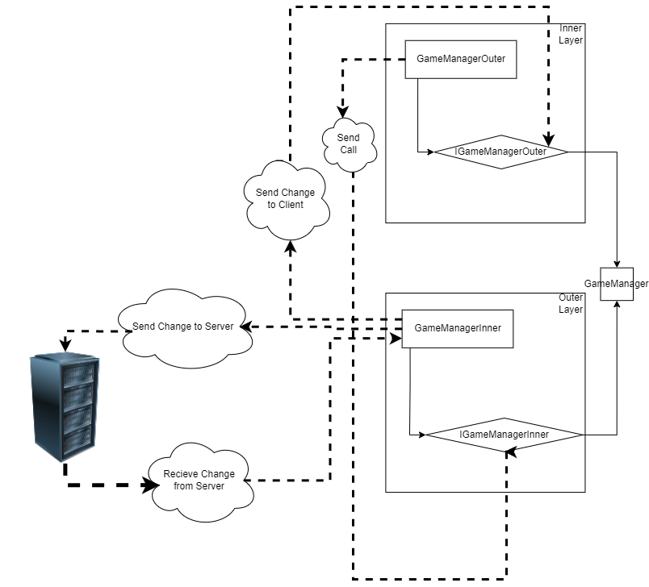

# Client Architecture

The client architecture is divided into 2 main part:
- **Inner**: The inner part is the part that is responsible for the communication with the server, handling the logic of the game and keeping track of the game state.
- **Outer**: The outer part is the part that is responsible for the rendering of the game, the user interface and the user input.

## Inner

The inner part was designed with the idea of being able to run the game without the outer part. 

Come from the Minecraft architecture, the inner part acts as a integrated server, which means that the inner part is responsible for the game logic and the communication with the server and listens to the server for updates.

## Outer

The outer part is the part that is responsible for the rendering of the game, the user interface and the user input. The outer part is a client that connects to the server and listens to the server for updates.

It mainly uses the Unity Engine to render the game and the user interface.

## Communication

The commnunication between the inner and the outer part is done through a Event System. The inner part sends events to the outer part and the outer part listens to these events and updates the game state accordingly.

The Event System is a simple system that uses the Observer Pattern to send events between the inner and the outer part.

- [Communication](./Communication.md)
- [Event System](./EventSystem.md)