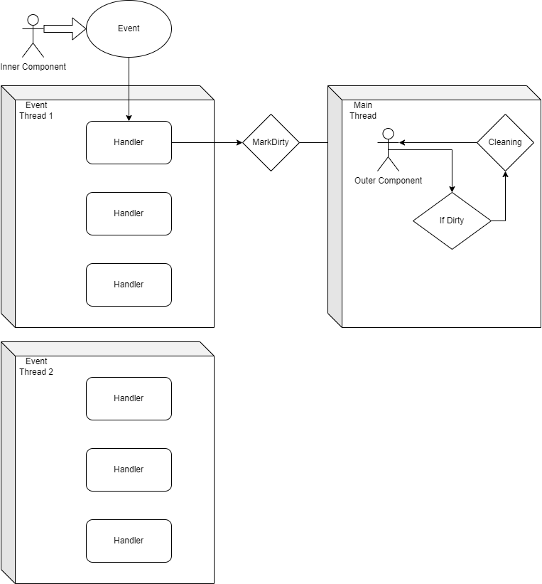

# Communication Between Inner and Outer Part

The communication between the inner and the outer part is done through a Event System. The inner part sends events to the outer part and the outer part listens to these events and updates the game state accordingly.

There will be a Main Thread that is responsible for the rendering of the game and the user interface, which means the outer part can only be updated in the Main Thread.

Because of that, the inner part will send events to the outer part and mark them as `Dirty`. The outer part will soon update the visual in the Main Thread.

- **OuterComponent**: [OuterComponent.cs](../com.ethnicthv/Outer/OuterObjectAbstract.cs)
- **InnerComponent**: [InnerComponent.cs](../com.ethnicthv/Inner/Object/GameEntity.cs)