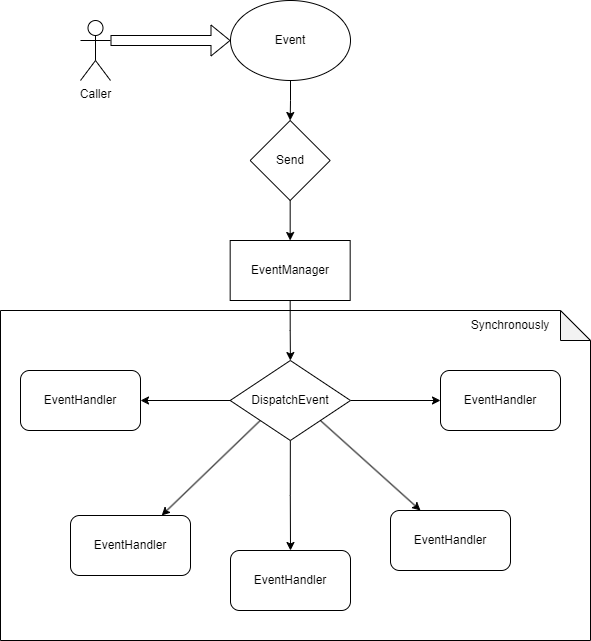

# Event System

The Event System is a simple system that uses the Observer Pattern.



There are 3 main components in the Event System:
- **Event**: The Event is the data that is sent to the Event System. It can be anything, from a simple string to a complex object. For example, a `PlayerMoveEvent` can be a simple string `"PlayerMove"` or a complex object `{"player": "player1", "position": [0, 0, 0]}`
- **EventManager**: The EventManager is the component that manages the events and the listeners.
- **Listener**: The Listener is the component that listens to the events.

The Caller sends an event to the Event System, the Event System then sends the event to all the Listeners. Each Listener can then handle the event synchronously or asynchronously.

## Event
To create a new Event, you need to create a new class that inherits from the `Event` class.

```csharp
public class PlayerMoveEvent : Event
{
    public string player;
    public Vector3 position;

    public PlayerMoveEvent(string player, Vector3 position)
    {
        this.player = player;
        this.position = position;
    }
}
```

Events can be simple or complex, depending on the data that you want to send.

It has to be serializable so that it can be sent over the network.

There are 2 functions that you can override in the `Event` class:
- `public abstract Packet PackEvent()` : This function is used to pack the event into a `Packet` so that it can be sent over the network.
- `public abstract void UnpackEvent(Packet packet)` : This function is used to unpack the event from a `Packet`.

More details about the `Event` class can be found in the [Event.cs](../com.ethnicthv/Util/Event/Event.cs) file.

## EventManager
The EventManager is the component that manages the events and the listeners.

It has 3 main functions:
- `public void RegisterHandler(HandlerType handlerType ,Type eventType, Delegate handler)` : This function is used to register a new handler for a specific event type.
- `public void UnregisterHandler(HandlerType handlerType, Type eventType, Delegate handler)` : This function is used to unregister a handler for a specific event type.
- `public async void DispatchEvent<T>(HandlerType handlerType, T e, CallbackFunction<T> callback = null)` : This function is used to dispatch an event to all the listeners of a specific event type.

There are 3 types of handlers:
- `HandlerType.Local` : The handler is for communication between inner and outer part.
- `HandlerType.Client` : The handler is for sending events to the server.
- `HandlerType.Server` : The handler is for receiving events from the server.

Each type of handler will be dispatched in a different way:
- `HandlerType.Local` : The event will be dispatched synchronously.
- `HandlerType.Client` : The event will be dispatched asynchronously in its own thread. Should only be used for sending events to the server.
- `HandlerType.Server` : The event will be dispatched synchronously in its own thread. Should only be used for receiving events from the server.

More details about the `EventManager` class can be found in the [EventManager.cs](../com.ethnicthv/Util/Event/EventManager.cs) file.

### Event Caller
To call an event, you need to call the `DispatchEvent` function of the `EventManager` class.

```csharp
EventManager.Instance.DispatchEvent(HandlerType.Local, new PlayerMoveEvent("player1", new Vector3(0, 0, 0)));
```

## Listener
The Listener is the component that listens to the events.

To create a new Listener, you need to create a new class with an attribute `[EventListener(eventType: T]` where `T` is the type of the event that the Listener listens to.

```csharp
[EventListener(eventType: typeof(PlayerMoveEvent))]
public class PlayerMoveListener
{
}
```

The Listener Handler is a function that has the handler attribute.

There are 3 types of handlers attributes that match the 3 types of handlers in the EventManager:
- `[LocalHandler]` : The handler is for communication between inner and outer part.
- `[ClientNetworkingSender]` : The handler is for sending events to the server.
- `[ServerNetworkingHandler]` : The handler is for receiving events from the server.

```csharp
[EventListener(eventType: typeof(PlayerMoveEvent))]
public class PlayerMoveListener
{
    [LocalHandler]
    public void OnPlayerMove(PlayerMoveEvent e)
    {
        // Handle the event
    }
    
    [ClientNetworkingSender]
    public void OnPlayerMove(PlayerMoveEvent e)
    {
        // Handle the event
    }
    
    [ServerNetworkingHandler]
    public void OnPlayerMove(PlayerMoveEvent e)
    {
        // Handle the event
    }
}
```

More details about the `Listener` class can be found in the [EventHandler.cs](../com.ethnicthv/Util/Event/EventHandler.cs) file.


